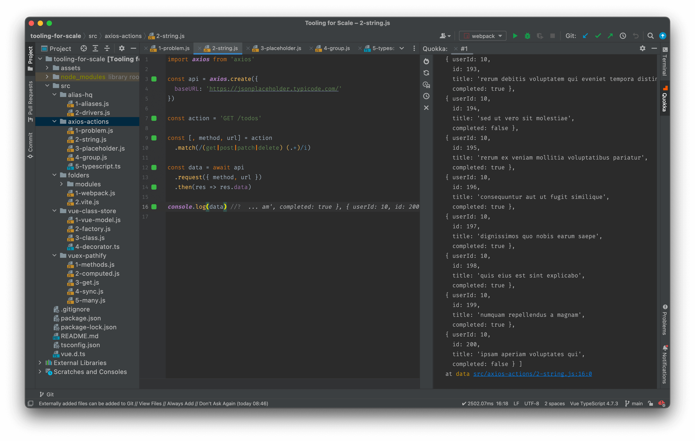

# Tooling for Scale

## Overview

In March 2022 I gave a talk to the [LA Vue Meetup](https://www.meetup.com/VuejsLA/) group about building tools to work better at scale.

The thrust of the talk was as projects get bigger, and more developers impose their styles and preferences, it gets harder to keep things organised, so simplifying the developer experience through better organisation and cleaner interfaces can have a radical impact.

I discussed five projects from the last five years which had presented particular scaling problems, and how I developed practical techniques and Open Source tools to solve them.

## The code

To provide a takeaway for the talk, I've broken out the core ideas for each project into files of 10 - 20 lines each.

Each file is self-contained, and can be run using the [Quokka JS](https://quokkajs.com/) plugin for VS Code or WebStorm:

Note you'll need the [pro version](https://quokkajs.com/pro/) to run files with imports, but it will be one of the best $50 you'll spend this year!

## The projects

The five problems / projects are:

- [Folder management](./src/folders) 
  Structure large projects using a hierarchical / modular format, or for Nuxt, [Nuxt Areas](https://davestewart.co.uk/projects/open-source/nuxt-areas/)

- [Import management](./src/alias-hq) 
  Define path aliases in a single file and consume across project dependencies with [Alias HQ](https://davestewart.co.uk/projects/open-source/alias-hq/)

- [API access](./src/axios-actions) 
  Bundle API endpoints as callable, reusable services with [Axios Actions](https://davestewart.co.uk/projects/open-source/axios-actions/)

- [Global state access](./src/vuex-pathify) 
  Simplify Vuex access using a unified path syntax and intuitive helpers with [Vuex Pathify](https://davestewart.co.uk/projects/open-source/vuex-pathify/)

- [Universal state format](./src/vue-class-store) 
  Model reactive stores as classes and use them locally or globally with [Vue Class Store](https://davestewart.co.uk/projects/open-source/vue-class-store/)

For each project I outline:

- the context in which the problem was identified
- the problem and its impact
- the solution as a finished Open Source project
- the core idea(s) in 10 - 20 lines of code
