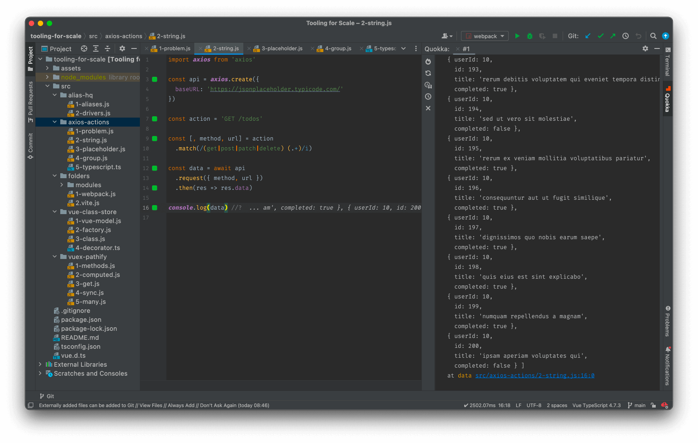

# Tooling for Scale

## Overview

In March 2022 I gave a talk to the [LA Vue Meetup](https://www.meetup.com/VuejsLA/) group about building to tools to work better at scale.

The thrust of the talk was as projects get bigger, and more developers impose their styles and preferences, it gets harder to keep things organised, so simplifying the developer experience through better organisation and cleaner interfaces can have a radical impact.

I discussed five projects from the last five years which had presented particular scaling problems, and how I developed practical techniques and Open Source tools to solve them.

## The code

For each project, I've broken out the core ideas into files of 10 - 20 lines each, showing the core ideas for each.

Each file is self-contained, and can be run using the [Quokka JS](https://quokkajs.com/) plugin for VS Code or WebStorm:

I can't remember if the free version will run files with imports, or just the pro version, but either way the code is available.

## The projects

In the talk, I presented 5 real-world commercial projects with five distinct attempts at solving an issue brought about by scale.

For each project I outlined:

- the company in which the problem was identified
- the problem and its impact
- the solution as a finished Open Source project
- the core idea(s) in 10 - 20 lines of code

### Folder management

> [Nuxt Areas](https://davestewart.co.uk/projects/open-source/nuxt-areas/) / Module pattern developed at [Asterisk](https://davestewart.co.uk/work/asterisk/), [Control Space](https://davestewart.co.uk/products/control-space/), [FGH](https://davestewart.co.uk/work/fgh/) and [Metalink](https://davestewart.co.uk/work/metalink/)

Structure large projects using a hierarchical / modular format.

See [src/folders](./src/folders).

### Path management

> [Alias HQ](https://davestewart.co.uk/projects/open-source/alias-hq/) developed between recent projects

Define path aliases in a single file and consume across project dependencies.  

See [src/alias-hq](./src/alias-hq).

### API access

> [Axios Actions](https://davestewart.co.uk/projects/open-source/axios-actions/) developed after [Clear Bank](https://davestewart.co.uk/work/clearbank/)

Bundle API endpoints as callable, reusable services.

See [src/alias-hq](./src/alias-hq).

### Global state access

> [Vuex Pathify](https://davestewart.co.uk/projects/open-source/vuex-pathify/) developed at [FairSquare](https://davestewart.co.uk/work/fairsquare/)

Simplify Vuex access using a unified path syntax and intuitive component helpers.

See [src/alias-hq](./src/alias-hq).

### Universal state format

> [Vue Class Store](https://davestewart.co.uk/projects/open-source/vue-class-store/) developed for [Control Space](https://davestewart.co.uk/products/control-space/).

Model reactive stores as classes and use them locally or globally

See [src/alias-hq](./src/alias-hq).
